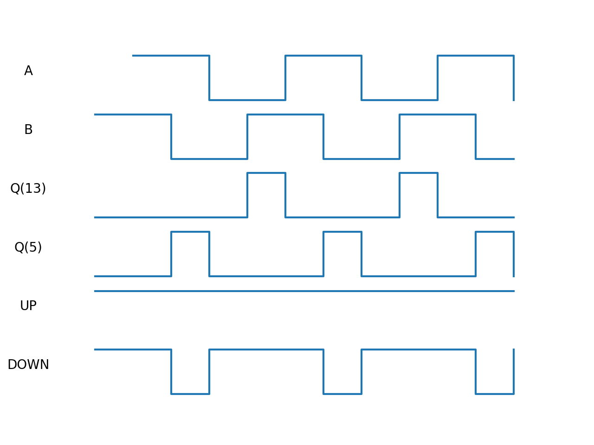

# timing
 タイミングチャートを描くためのモジュールです

# Usage
簡単にプロットする例: 
``` {.sourceCode .python}
>>> import timing
>>> d = timing.Diagram()
>>> d.add_timing("test", [0,1,0,1,0])
>>> d.plot()
<class 'matplotlib.axes._subplots.AxesSubplot'>
```

# テキストファイルからプロットする
以下のようなテキストファイルからタイミングチャートを作成できます。
``` :test_chart
A     : ~~__~~__~~_
B     :~~__~~__~~__
Q(13) :____~___~___
Q(5)  :__~___~___~_
UP    :~~~~~~~~~~~~
DOWN  :~~_~~~_~~~_~
```


``` {.sourceCode .python}
>>> from timing import Diagram, parser
>>> d = Diagram()
>>> data = parser.read_timing("test_chart")
>>> for i in data:
...     print(i)
...     d.add_timing(*i)
...
('A', [None, 1, 1, 0, 0, 1, 1, 0, 0, 1, 1, 0])
('B', [1, 1, 0, 0, 1, 1, 0, 0, 1, 1, 0, 0])
('Q(13)', [0, 0, 0, 0, 1, 0, 0, 0, 1, 0, 0, 0])
('Q(5)', [0, 0, 1, 0, 0, 0, 1, 0, 0, 0, 1, 0])
('UP', [1, 1, 1, 1, 1, 1, 1, 1, 1, 1, 1, 1])
('DOWN', [1, 1, 0, 1, 1, 1, 0, 1, 1, 1, 0, 1])
>>> d.plot()
<class 'numpy.ndarray'>
```

## Result
 

## 注意点
テキストファイルから読み込む際は以下の点に注意してください

- コロン```:```より前のスペースは無視されます。以下の２つは同じように読み込まれます。
```
A    : _~_
A:_~_
```

- 全てのシグナルは長さが同じである必要があります。以下は悪い例です。
```
A: _~_
B: _~_~
```
